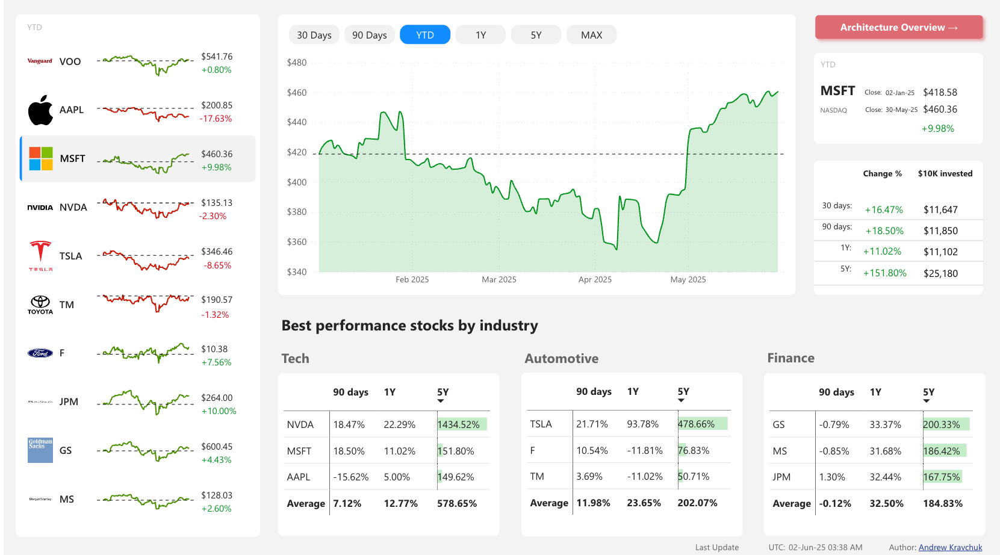
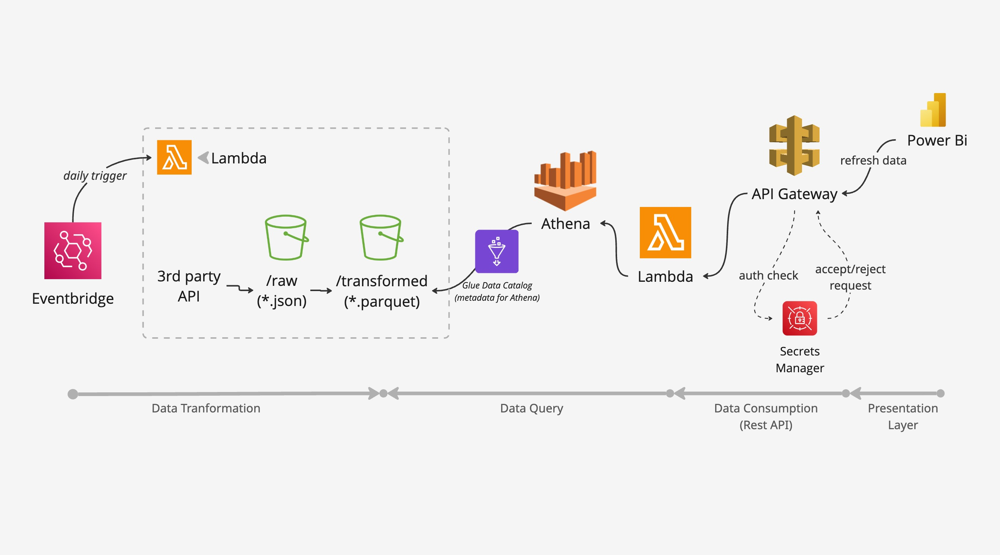

# Serverless AWS stock-market analytics

This repository runs a deliberately small stock-market pipeline on AWS. It uses
two Lambda functions from one Docker image and stores business data under only
two S3 prefixes: `raw/` and `transformed/`.

## Dashboard



The report compares stock performance across technology, automotive, and
financial companies, with selectable time ranges, investment-return analysis,
and industry-level rankings.

## Architecture



There is no ECS, Fargate, dbt, Iceberg, Glue crawler, Glue ETL job, or
pre-generated Power BI export.

## Where Glue metadata is stored

The `stock_market.prices` definition is stored in the regional,
AWS-managed Glue Data Catalog. It is not an object or folder in either S3
bucket.

The catalog entry stores:

- database and table names;
- the twelve column names and data types;
- Parquet input and serialization formats;
- the `load_date` partition definition and projection rules;
- the S3 location for `transformed/prices/`.

Athena resolves the table through this hierarchy:

```text
AwsDataCatalog
└── stock_market
    └── prices
        └── S3 location: transformed/prices/
```

The Glue catalog stores no stock-price rows. Athena loads the metadata while
planning a query, then reads the actual Parquet rows directly from S3.

## S3 layout

```text
data bucket/
├── raw/
│   └── twelvedata/load_date=YYYY-MM-DD/run-id/SYMBOL.json
└── transformed/
    └── prices/load_date=YYYY-MM-DD/part-run-id.parquet
```

Athena query output is isolated in a second bucket and expires after one day.
The Glue Data Catalog contains one database and one table, `stock_market.prices`.
It stores metadata only; the rows remain in S3.

Daily loads overlap by ten days. The REST queries use `row_number()` to select
the latest extraction for each `(symbol, price_date)`, so reruns are
idempotent without rewriting old Parquet files.

## REST API

All endpoints use generated HTTP Basic credentials:

- `GET /v1/prices?symbol=AAPL&start=2026-01-01&end=2026-07-29`
- `GET /v1/dim-symbol`
- `GET /v1/dim-date`
- `GET /v1/fact-daily`
- `GET /v1/health`

The final three table endpoints preserve the existing Power BI model contract.
API requests select from predefined SQL templates; clients cannot submit
arbitrary SQL.

## Configure

Create `.env` in the repository root:

```dotenv
TWELVE_DATA_API_KEY=your-key
```

The legacy name `TWELWE-DATA-API` is also accepted by the secret configuration
script. `.env` is ignored by Git.

## Test

```bash
python3 -m venv .venv
source .venv/bin/activate
pip install -r requirements-dev.txt
pytest
ruff check src tests ops
aws cloudformation validate-template \
  --template-body file://infrastructure/cloudformation/stack.yaml \
  --region us-east-1
```

## Deploy

Docker and AWS CLI credentials are required:

```bash
./ops/deploy.sh
```

The script creates or reuses ECR repository `aws-stock-market-poc`, builds an
ARM64 Lambda image, pushes it with an immutable timestamp tag, deploys the
CloudFormation stack, and copies the Twelve Data key into Secrets Manager
without printing it. The schedule is disabled by default.

Run the historical load:

```bash
.venv/bin/python ops/run_task.py --mode backfill
```

Enable the daily schedule after validation:

```bash
./ops/set_schedule.sh ENABLED
```

Retrieve the API URL and Basic credentials:

```bash
.venv/bin/python ops/show_powerbi_credentials.py
```

## Runtime roles

- Ingestion Lambda calls Twelve Data and writes `raw/` and `transformed/`.
- Query Lambda runs allowlisted Athena SQL and converts results to REST JSON.
- Glue describes the Parquet schema and S3 location to Athena.
- The dedicated Athena workgroup limits each query to 1 GiB scanned.
- API Gateway throttles the API to two requests per second with a burst of five.
- API Gateway writes structured access logs to
  `/aws/apigateway/aws-stock-market-api` with a 14-day retention period.

Follow endpoint invocations with:

```bash
aws logs tail /aws/apigateway/aws-stock-market-api \
  --region us-east-1 \
  --follow
```

The logs include request ID, time, source IP, method, path, route, status,
response size, response latency, integration latency, and integration errors.
Authorization headers and Basic credentials are not logged.

This design favors clarity and low idle cost. Athena adds seconds of latency, so
it is appropriate for Power BI refreshes and low-volume analytical requests,
not a high-traffic transactional API.
